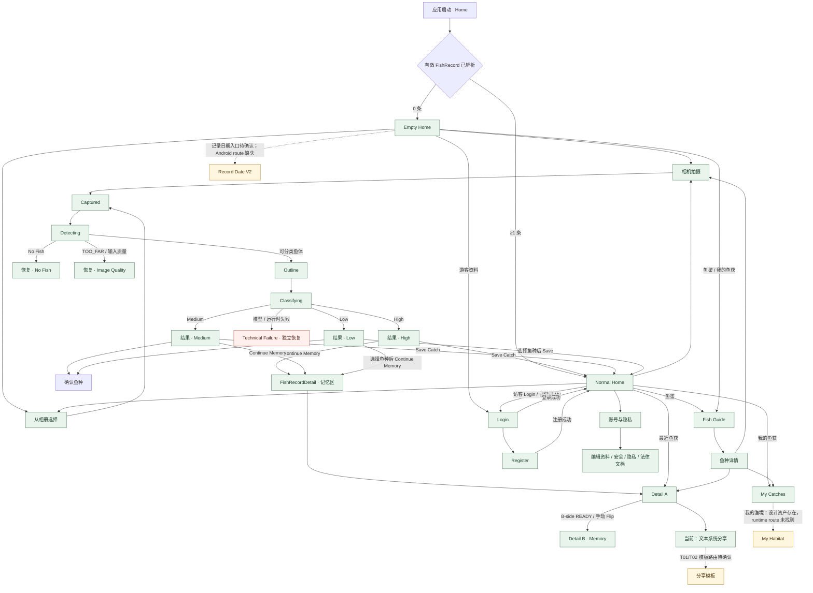

# 产品主流程 · YuJian V3.1 Phase 1

**状态：AUDIT_DRAFT** · 审计基线：`main@7737f293ea3831aeea2c6f58308961cdb2ba7d01` · 生成时间：2026-10-11T03:13:33.267Z

本图把已查证的 Android 当前路径、已冻结设计意图和待确认连接分开。Design Manager 跳转只表示可查看该设计项，不代表 Android 已实现该导航。

## 全局主链路

## 已查证与待确认的解释

- Home 是同一个页面的 EMPTY / NORMAL 状态，登录状态与记录数量正交；用户动作连接在当前 `YujianApp.kt` 中可查。
- Recognition 的代码状态顺序是 Captured → Detecting → Outline → Classifying；结果根据状态解析到 High / Medium / Low。No Fish 与 Image Quality 通过 `recognition_issue` 恢复；Technical Failure 由独立的失败字段与 UI 分支呈现，**不计入 3+2**。
- 当前阈值来自现行代码：`p1 < 0.45 → Low`；否则若 `p1 - p2 < 0.12 → Medium`；否则 High。V1.1 Decision Spec 标明其变更建议尚未授权，不能当成新冻结规则。
- 普通 **Save Catch** 按冻结行为合同与当前代码返回 Home；**Continue Memory** 创建 FishRecord 成功后进入同一详情页并聚焦记忆区。此现状与任务给出的简写主链“保存鱼获 → Detail A → Detail B”不一致，需要产品所有者确认普通保存是否应继续回 Home。
- Record Date V2 的月 / 年视觉与交互设计目标已冻结，但当前 Android `NavHost` 没有对应 route 或 Home callback。My Habitat 的 level reference 已入库，但没有 runtime route。T01 / T02 分享设计存在，当前 Android 详情分享仍是 `text/plain` chooser。
- `my_catches/day/{dayKey}` 是 My Catches 的日详情，不能等同于 Record Date V2。

## 业务域流程与可点击映射

| 业务域 | 流程源 | 设计 / Manager 入口 |
|---|---|---|
| 首页 | [首页子流程](subflows/Home_V3_1.md) | `#page/home_empty_v2` · `#page/home_normal_v1/hifi/NH02` |
| 识别 | [识别子流程](subflows/Recognition_V3_1.md) | `#page/recognition_flow_v1_2/hifi/state_timeline` · `#page/recognition_result_v1/hifi/high` |
| 鱼获记录与记忆 | [详情子流程](subflows/Fish_Record_Memory_V3_1.md) | `#page/fish_record_detail_v2/hifi/a_side` · `#page/fish_record_detail_v2/hifi/b_side` |
| 记录日期 | [记录日期子流程](subflows/Record_Date_V3_1.md) | `#page/record_date_v2/hifi/month_v2` |
| 我的鱼获 / 我的渔境 | [我的鱼获子流程](subflows/My_Catches_Habitat_V3_1.md) | `#page/my_catches_v2/hifi/main` · `#page/my_catches_v2/hifi/habitat` |
| 鱼鉴 | [鱼鉴子流程](subflows/Fish_Guide_V3_1.md) | `#page/fish_guide_v2/hifi/home` · `#page/fish_guide_v2/hifi/species_detail` |
| 账号与隐私 | [账号子流程](subflows/Account_Privacy_V3_1.md) | `#page/account_privacy_v1` · `#page/auth_login_v2` |
| 分享 | [分享子流程](subflows/Sharing_V3_1.md) | `#page/share_templates_v1/hifi/01_overview` |

## 机器可读数据

- 节点及连线：[`master_flow_v3_1.json`](master_flow_v3_1.json)（每个节点含 trigger、guard、entry/exit、Manager route、视觉 / 行为 authority、shared dependencies、设计与验证状态）。
- 全部注册页、hifi、嵌套项、场景与共享系统：[`page_state_authority_map_v3_1.json`](../01_Page_Registry/page_state_authority_map_v3_1.json)。
- 可点击的 Manager 总览：[index.html](index.html)，链接指向现有 Design Manager 路由。
- 每个流程节点来源、route 及当前状态详见 JSON；所有 `TO_CONFIRM`、`UNVERIFIED` 和 `DESIGN_ONLY` 边都明确保留。
