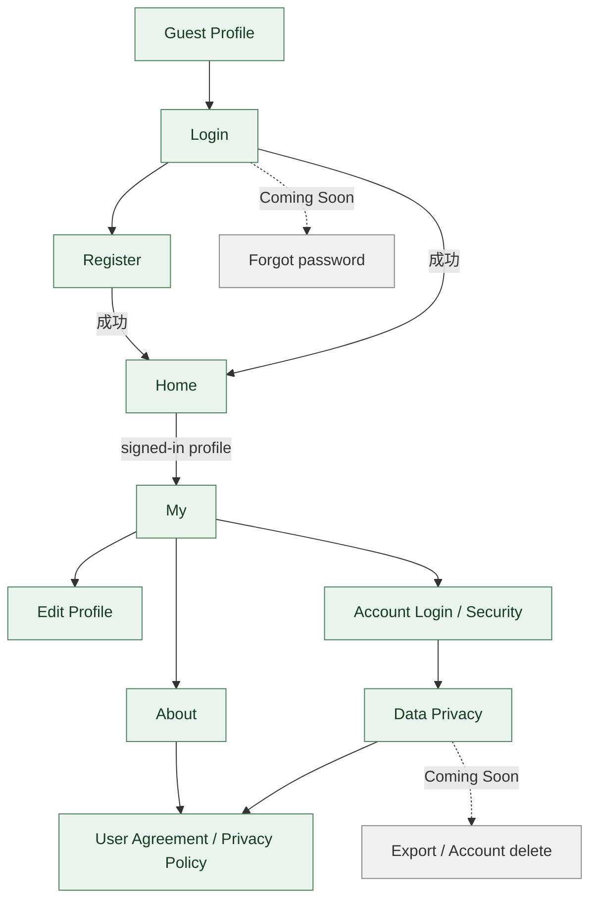

# 账号与隐私子流程 · V3.1 Phase 1

**状态：AUDIT_DRAFT** · 游客 / 登录态与 Home Empty / Normal 状态独立。

登录 / 注册、资料、账号安全、隐私设置和法律页入口在当前 Android NavHost 有 route；App 的 auth/profile/privacy repository 对应后端注册、登录、资料、密码、隐私 API。Forgot Password、数据导出、账号删除等现有 UI 明确 Coming Soon / Deferred，不能列为可用闭环。
