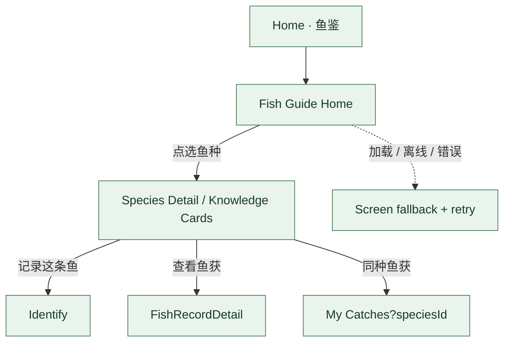

# 鱼鉴子流程 · V3.1 Phase 1

**状态：AUDIT_DRAFT** · Fish Guide registry 当前 6 个 hifi views 与 2 个 nested child 已收录。

当前代码已注册 guide 和 species detail route；FishKnowledgeRepository 对应后端 `GET /api/v1/fish/species` 与 `GET /api/v1/fish/species/{id}/detail`。API 是否在特定环境部署、图片内容来源授权是否齐备，属于独立运行与素材来源验证项；本次只记录 main 的代码路径。
