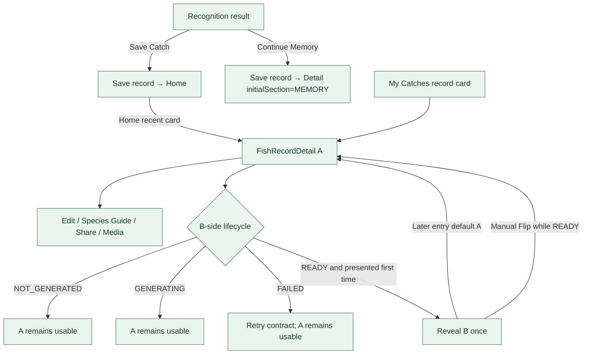

# 鱼获记录与记忆子流程 · V3.1 Phase 1

**状态：AUDIT_DRAFT** · 依据 FishRecordDetail V2 authority 与当前 app route。

Detail A/B 是同一个 FishRecordDetail destination；首个 READY B 面仅在真实呈现后消耗一次自动揭示，后续默认 A，READY 时才显示 Flip。当前 Save Catch → Home；Continue Memory → `catch/{id}?section=memory`。当前 `onShare` 是系统文本分享。内联照片/视频可由 Fish Memory Capture 与 media contract 承接，B-side生成仍需区分签入态与后端状态。

**待核实：** “保存普通鱼获必须直接到 Detail A”与现行合同不一致，列入产品决策。运行时状态 / evidence 覆盖仍为 PARTIAL。
