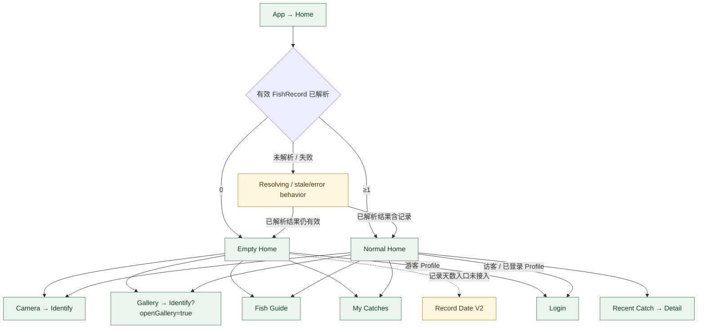

# 首页子流程 · V3.1 Phase 1

**状态：AUDIT_DRAFT** · 来源：`app/src/main/java/com/yujian/ai/YujianApp.kt`、Home authority docs。

首页状态合同确认 EMPTY = 已解析且 0 条有效 FishRecord；NORMAL = 已解析且至少 1 条。登录 / 游客与 Empty / Normal 正交。NH02 是 1 / 1 / 1 第一条记录的 Normal Home 高保；NH01 是多记录主画面；NH07 头像状态为 SPEC_FROZEN，整页 runtime 尚未更新。Manager 直接路由见 `#page/home_normal_v1/hifi/NH01–NH07`。

**待确认：** Normal Home “记录天数”应进入 Record Date 的设计目标冻结，但 Android 仍未实现该入口；本轮不新增 route。
