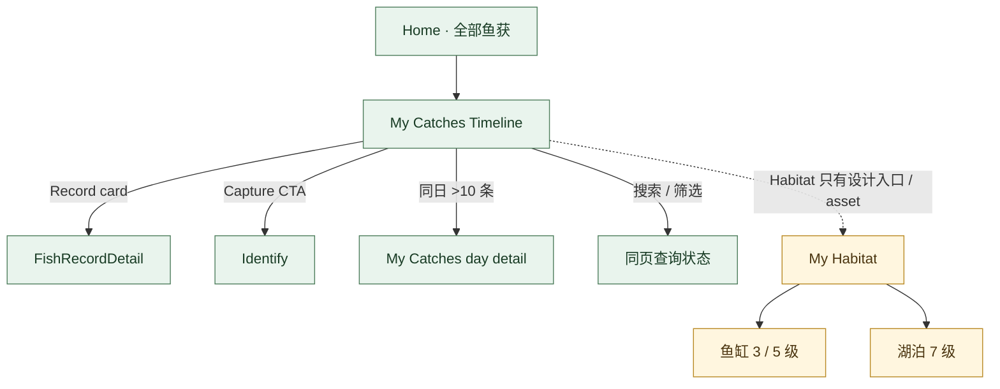

# 我的鱼获 / 我的渔境子流程 · V3.1 Phase 1

**状态：AUDIT_DRAFT** · 13 个 Scenario Page 仍纳入索引，其中包含 Timeline、搜索、筛选、空态与 Loading / Error。

主页面、Timeline、搜索、筛选、加载错误、空态及 13 个场景按 registry / scenario index 入图。Home → My Catches、记录卡 → Detail、拍摄 CTA → Identify、日详情 route 均见现有代码。My Habitat level reference assets 存在，但注册状态为 DESIGN_ONLY / runtime route 未找到；本轮不把鱼缸、鱼塘、湖泊绘成已可达 Android 页面。
