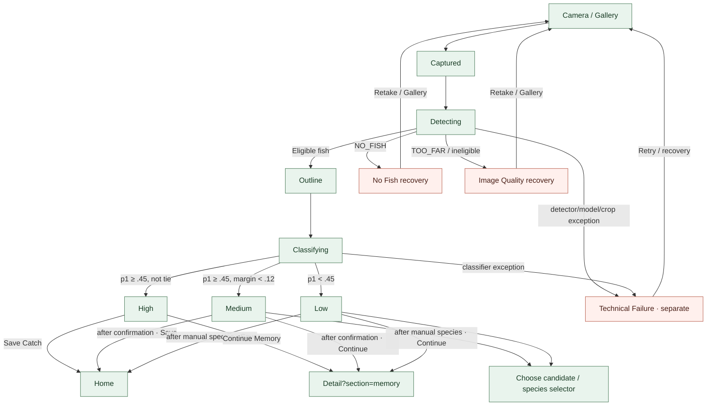

# 识别子流程 · V3.1 Phase 1

**状态：AUDIT_DRAFT** · 当前实现与设计建议分栏核对；不变更阈值或结果语义。

3+2 定义为三种鱼种结果状态 + 两种图片输入恢复状态，Technical Failure 单独处理。当前 route / state 证据来自 `FishRecognitionPipeline.kt`、`RecognitionStateMachine.kt`、`RecognitionUiState.kt`、`YujianApp.kt`。当前赋值阈值为 p1 .45、候选 margin .12；V1.1 decision 文档写明新的行为建议需单独批准。Result spec 要求 Medium/Low 先明确确认鱼种；保存失败留在 Result 且保留字段。

**语义缺口：** 当前 RR05 / Image Quality 映射含 TOO_FAR/小目标，但并非所有路由均由模糊、曝光等像素质量测量触发。已登记为 P1，需确保解释文本与真实失败原因一致。
