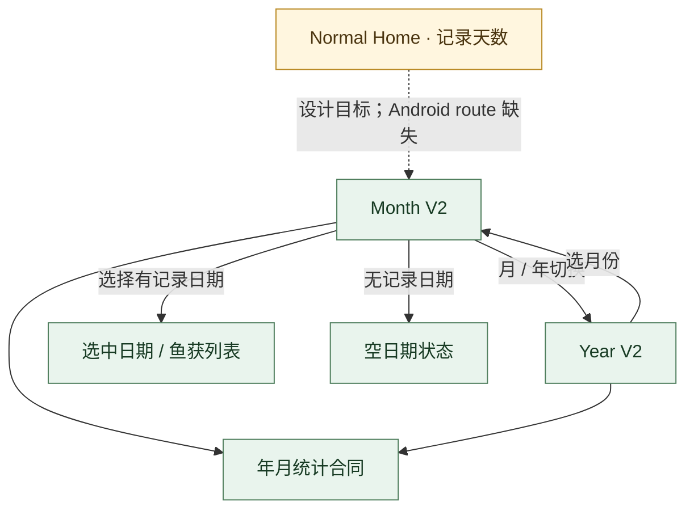

# 记录日期子流程 · V3.1 Phase 1

**状态：AUDIT_DRAFT** · 设计图冻结不等于运行时导航冻结。

RD01 月、RD02 年图冻结，RD03 交互和统计目标冻结；年图样例顶部 68 与 12 月合计 59 有已知数据例外，动态值必须遵守年度合计 = 月计数和。月/年源 PNG 的 declared SHA 存在，但审计 API 未返回原始大文件字节，当前登记为 `BLOCKED_ACCESS`。当前 `NavHost` 无 Record Date route；My Catches 的 `my_catches/day/{dayKey}` 是另一条日详情路径。
