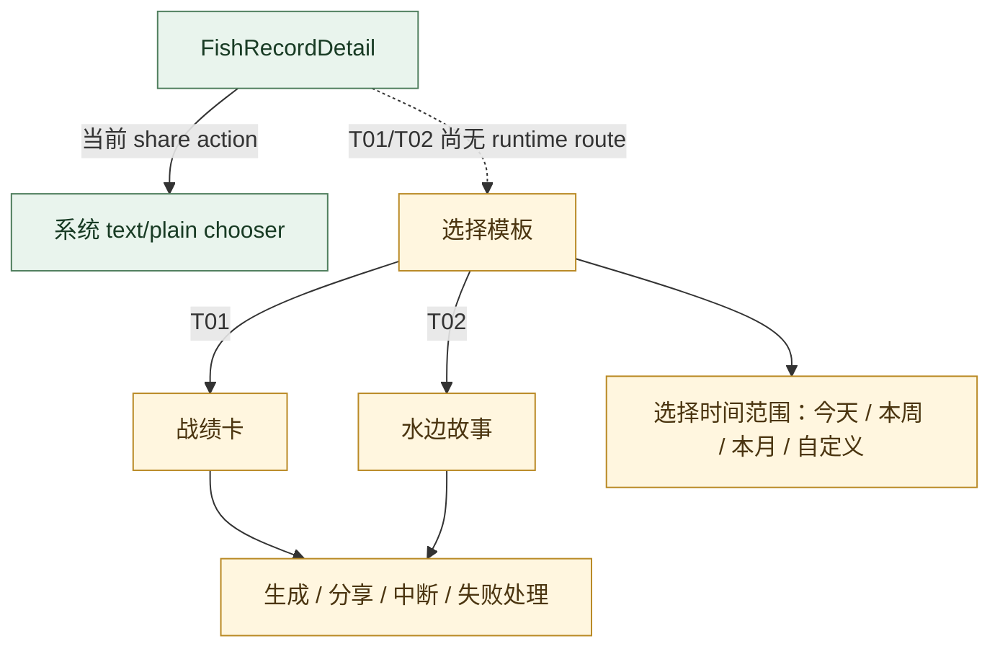

# 分享子流程 · V3.1 Phase 1

**状态：AUDIT_DRAFT** · Template × Time Range 是设计模型；现行 Android 分享能力仍是文本 chooser。

Product Model V1 定义两种模板和当前范围，但 T01/T02 visual status 为 PARTIAL，未找到 Android template-selection route。图片/视频 selection、export provenance、share interruption/error recovery 等不作已实现声明。
